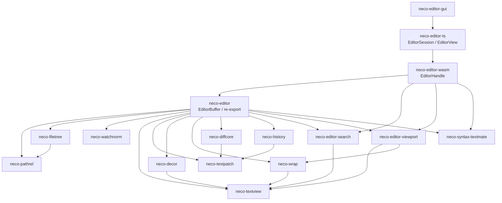
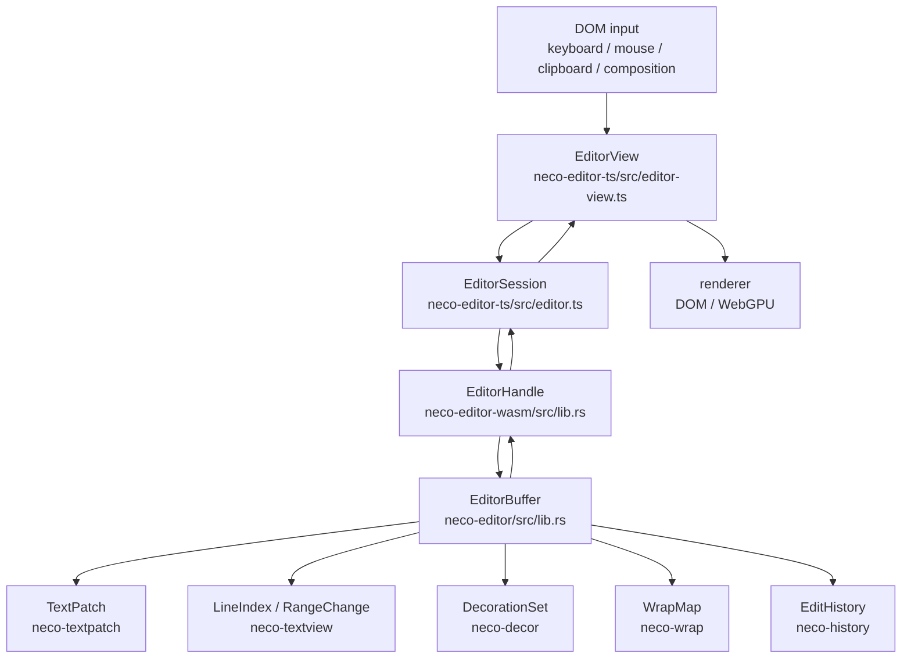
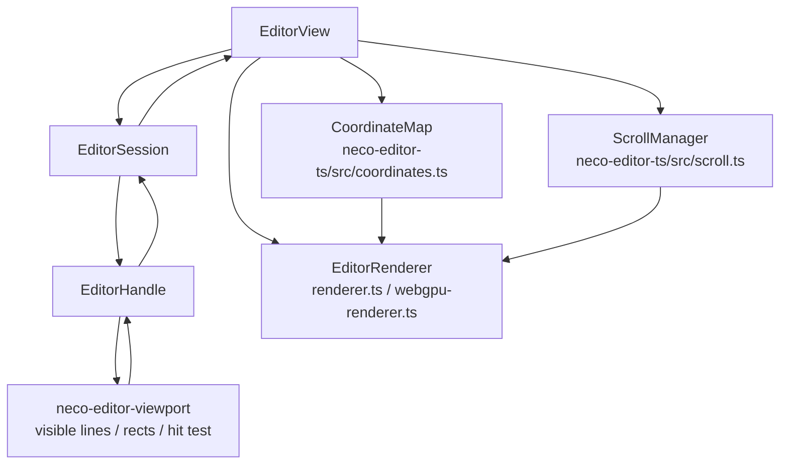

# neco editor

[日本語](README-ja.md)

`neco editor` is a set of Rust crates and a TypeScript package for building editor runtimes. The crates cover everything from low-level text buffers and syntax highlighting to WebAssembly bindings, with a host-agnostic TypeScript layer on top for DOM rendering.

This repository collects editor-side primitives that were factored out of an application codebase into independently publishable units. Each crate handles one narrow concern so they can be consumed separately on crates.io.

## Crates

| Crate | Summary | Internal dependencies | Main external dependencies |
|---|---|---|---|
| [`neco-pathrel`](./neco-pathrel) | string-based path relation and rename remap helpers | none | none |
| [`neco-filetree`](./neco-filetree) | pure file tree lookup, merge, flatten, and reveal helpers | `neco-pathrel` | none |
| [`neco-textpatch`](./neco-textpatch) | deterministic narrow text patch helpers for small structured edits | none | none |
| [`neco-watchnorm`](./neco-watchnorm) | host-agnostic file watcher event normalization and batch coalescing | none | none |
| [`neco-textview`](./neco-textview) | line-indexed text buffer with efficient position/offset conversion | none | none |
| [`neco-decor`](./neco-decor) | span-based decoration model for editor overlays | `neco-textview` | none |
| [`neco-diffcore`](./neco-diffcore) | minimal diff engine for line-level change detection | none | none |
| [`neco-wrap`](./neco-wrap) | soft-wrap line map for monospace editors | `neco-textview` | none |
| [`neco-history`](./neco-history) | generic undo/redo history with tree-based branching | `neco-tree` (neco-crates) | none |
| [`neco-syntax-textmate`](./neco-syntax-textmate) | TextMate grammar tokenizer built on syntect | none | `syntect` |
| [`neco-editor`](./neco-editor) | editor buffer combining text, decorations, wrapping, history, and syntax | all above | none |
| [`neco-editor-viewport`](./neco-editor-viewport) | pixel-geometry helpers for visible-line ranges, caret rects, selection rects, and hit-testing | `neco-textview`, `neco-wrap` | none |
| [`neco-editor-search`](./neco-editor-search) | buffer search engine (plain text, regex, whole-word) | `neco-textview` | `regex` |
| [`neco-editor-wasm`](./neco-editor-wasm) | wasm-bindgen bindings exposing `EditorHandle` as an opaque WASM export | `neco-editor`, `neco-editor-viewport`, `neco-editor-search`, `neco-syntax-textmate` | `wasm-bindgen`, `js-sys` |

## npm package

| Package | Summary |
|---|---|
| [`neco-editor-ts`](./neco-editor-ts) | host-agnostic TypeScript API wrapping `neco-editor-wasm`. Provides `EditorSession` (WASM compute layer) and `EditorView` (DOM rendering, input handling, virtual scroll). |

## Demo apps

Applications used for runtime verification. Not published to crates.io or npm, and not part of the editor runtime dependencies.

| App | Summary |
|---|---|
| [`neco-editor-gui`](./neco-editor-gui) | standalone desktop app mounting `neco-editor-ts` in a Tauri v2 window. Framework-less Vite + TypeScript frontend for exercising `EditorView` in isolation |

## Architecture

### Dependency graph

### Edit data flow

### Display and coordinates

### TypeScript layer

| File | Responsibility |
|---|---|
| `neco-editor-ts/src/editor.ts` | `EditorSession`: typed wrapper around WASM `EditorHandle` |
| `neco-editor-ts/src/editor-view.ts` | `EditorView`: integrates session, renderer, scroll, input, mouse, clipboard |
| `neco-editor-ts/src/renderer.ts` | DOM renderer and renderer interface |
| `neco-editor-ts/src/webgpu-renderer.ts` | WebGPU renderer |
| `neco-editor-ts/src/coordinates.ts` | branded types and transforms for document / viewport / container / screen coordinates |
| `neco-editor-ts/src/input.ts` | keyboard input to editor command mapping |
| `neco-editor-ts/src/mouse.ts` | mouse input and hit test integration |
| `neco-editor-ts/src/clipboard.ts` | clipboard and paste handling |
| `neco-editor-ts/src/scroll.ts` | scroll state management |
| `neco-editor-ts/src/theme.ts` | theme KDL parsing and token style mapping |

Each crate is intentionally independent so it can be published and consumed separately on crates.io. The repository is a maintenance monorepo; each crate stands on its own as a library.

This repository is still under active development, and crates vary in maturity. Some parts are already usable, while others are still being hardened or reshaped.

Updates may still change internal implementations relatively often. In particular, algorithm swaps and performance-oriented rewrites are more likely than long-term API stability across every crate.

## Status

- Workspace formatting, lint, and test gates are maintained at the repository level.
- GitHub Actions CI is configured in [`.github/workflows/ci.yml`](./.github/workflows/ci.yml).
- Individual crates may evolve at different speeds.

## Contribution

Issues and pull requests are welcome. In practice, focused requests with a clear target are easier to review and validate than broad or vague proposals.

See [CONTRIBUTING.md](./CONTRIBUTING.md) for development workflow and [SECURITY.md](./SECURITY.md) for security reporting.

## Support

If these crates or related apps are useful to you, you can support ongoing development here:

- OFUSE: <https://ofuse.me/barineco>
- Ko-fi: <https://ko-fi.com/barineco>

Support helps sustain maintenance, documentation, and ongoing development.

## License

Unless noted otherwise, this repository is licensed under the [MIT License](./LICENSE).
